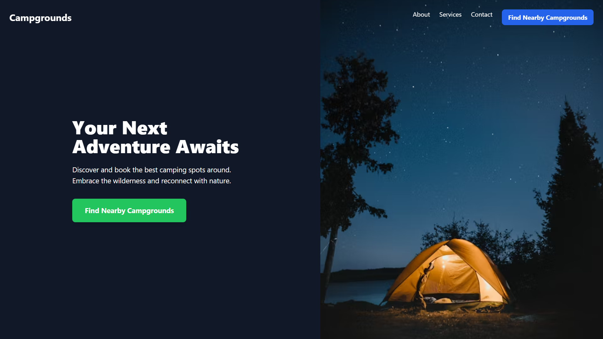
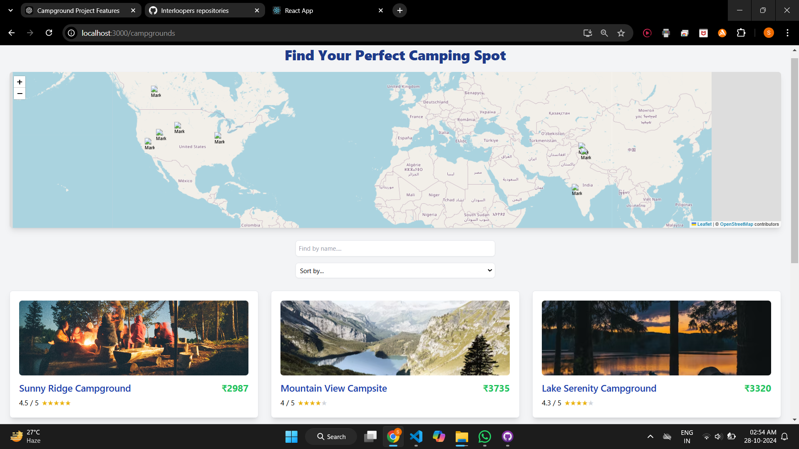
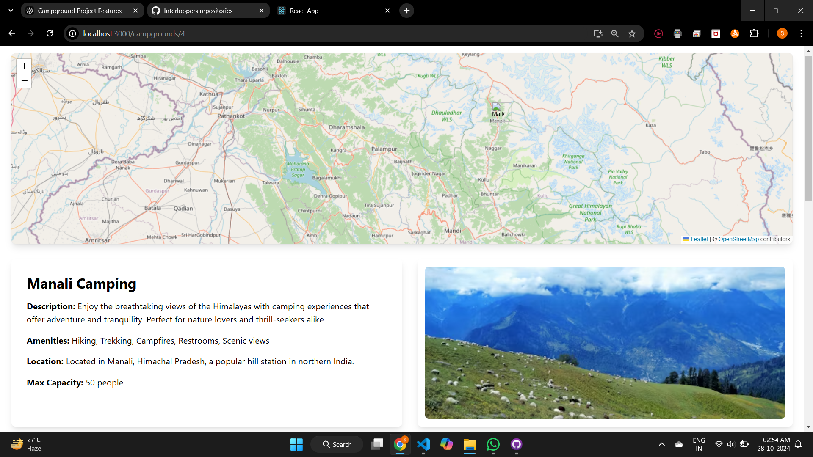
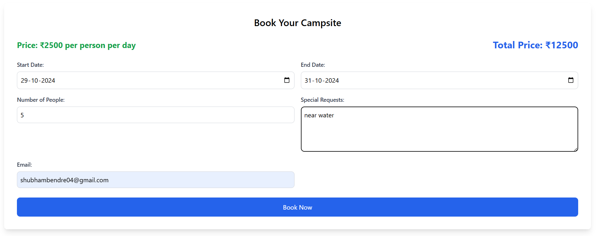
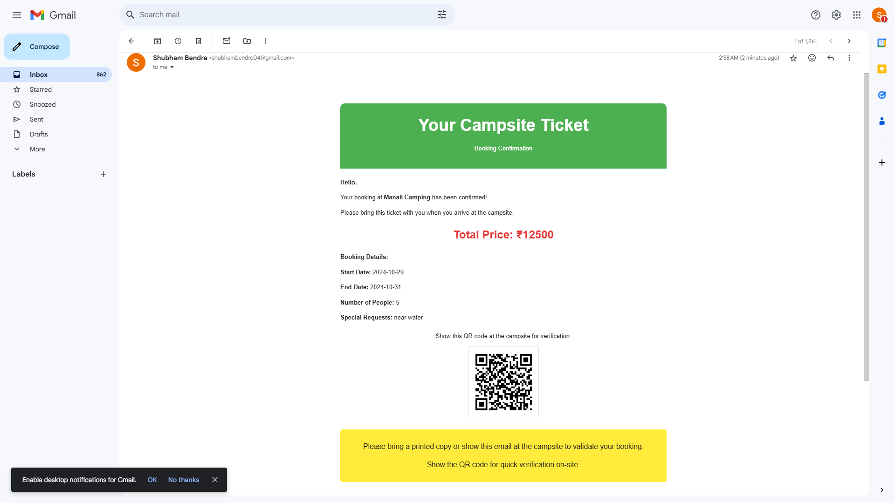
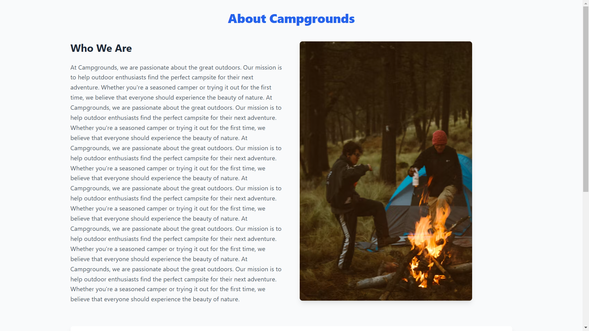
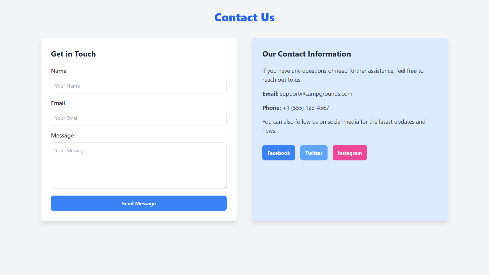

# 🏕️ CampGrounds

Welcome to **CampGrounds** – a full-stack platform designed to help users discover, book, and review the perfect campsite. With a focus on simplicity and functionality, **CampGrounds** makes planning your outdoor adventure seamless and enjoyable!

---

## 🌟 Features

- **Dynamic Search:** 🔍 Easily find campgrounds based on location, amenities, and user preferences.
- **Booking System:** 📅 Effortlessly reserve your chosen campsite with a secure and streamlined booking process.
- **Image Galleries:** 🖼️ Browse high-quality images of each campground for a better understanding of the site.
- **QR Code Confirmation:** 📧 Receive an email with a unique QR code for quick and paperless check-in.
- **Reviews & Ratings:** ⭐ Share and read genuine reviews to help others make informed decisions.
- **User-Friendly Interface:** 🖥️ Enjoy an intuitive and visually rich experience for smooth navigation.

---

## 🚀 Tech Stack

- **Frontend:** HTML, CSS-Bootstrap, React.js
- **Backend:** Node.js, Express.js
- **Database:** MongoDB

---

## 📋 Modules Overview

1. **Home Page** – Explore popular campgrounds and use the search bar to find sites by location or amenities.
2. **Campground Listings** – View detailed listings with images, descriptions, and booking options.
3. **Campground Details** – Get an in-depth view of each campground, including available amenities and visitor reviews.
4. **Booking Confirmation** – Complete bookings and receive confirmation via email with a QR code.
5. **Reviews & Ratings** – Leave reviews and ratings after your trip to help future campers.

---

## 🔍 Key Features Explained

- **Dynamic Search**: 🔍 Quickly find your ideal campsite using an intuitive search system based on location and amenities.
- **Secure Bookings**: 🔒 Make reservations easily with a secure booking process.
- **QR Code Check-In**: ⚡ Present your unique QR code at check-in for a hassle-free experience.
- **Post-Trip Reviews**: 💬 Share feedback and rate your camping experience to guide others.

---

## 📸 Screenshots

### 1️⃣ Home Page


### 2️⃣ Campground Listings


### 3️⃣ Campground Details


### 4️⃣ Booking


### 5️⃣ Email


### 6️⃣ Reviews & Ratings


### 7️⃣ About


### 8️⃣ Services


### 9️⃣ Contact Us


---

## 🕹️ **Installation**  
1. Clone the repository:  
   ```bash
   git clone https://github.com/Shubham-Bendre/CampGrounds.git

2. Run in Terminal:
   ```bash
   npm run start
